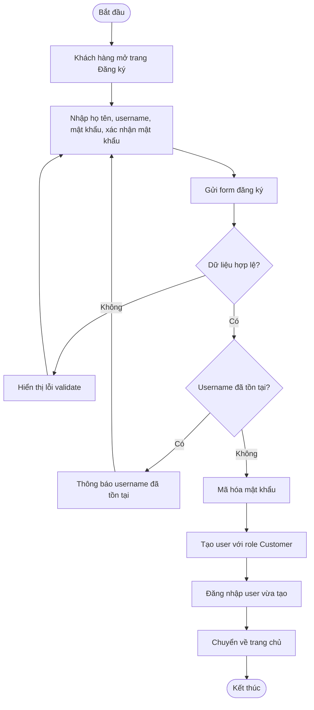
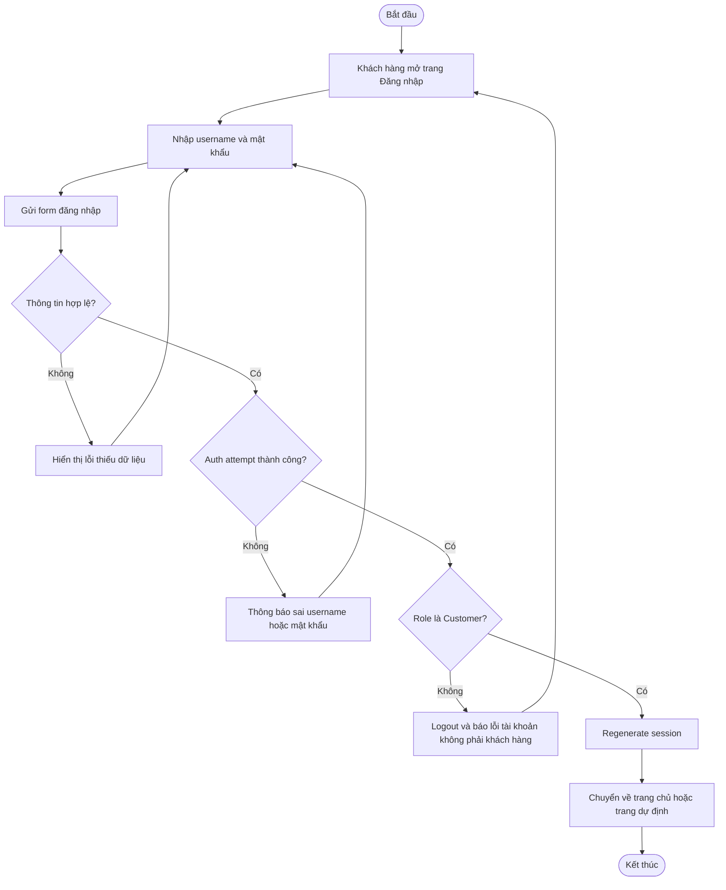
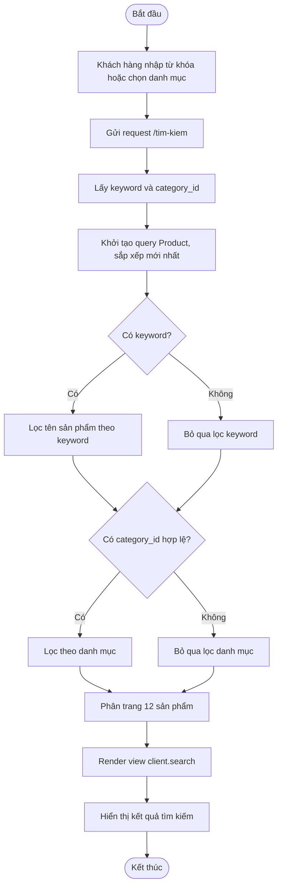
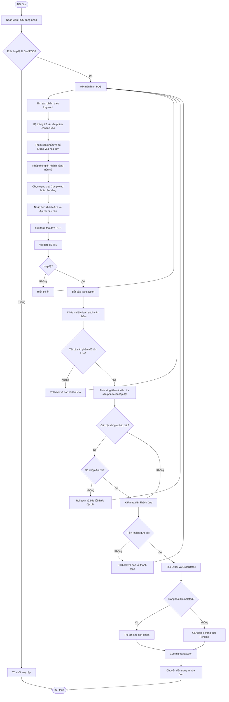
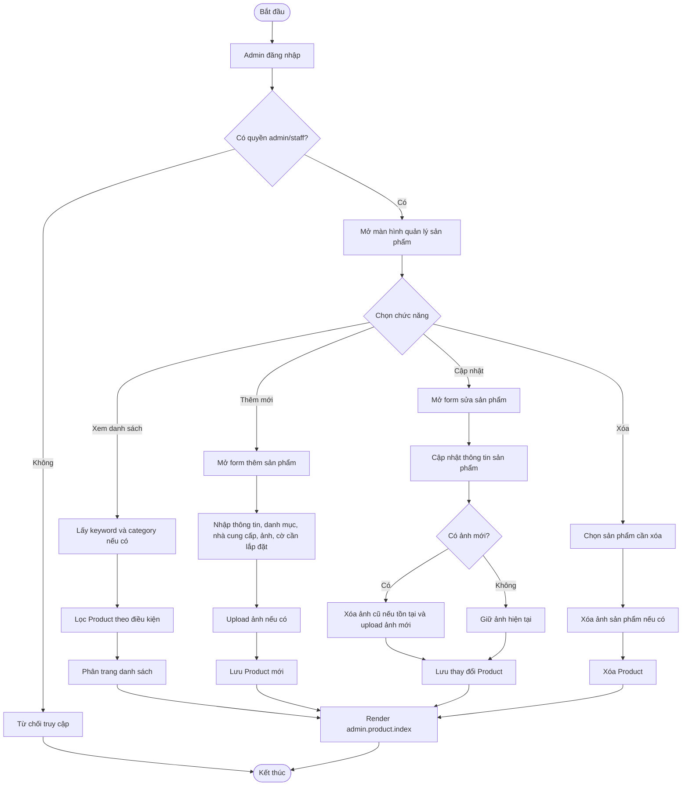
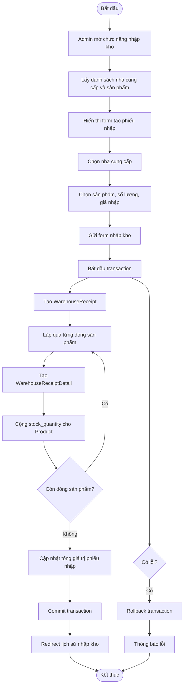
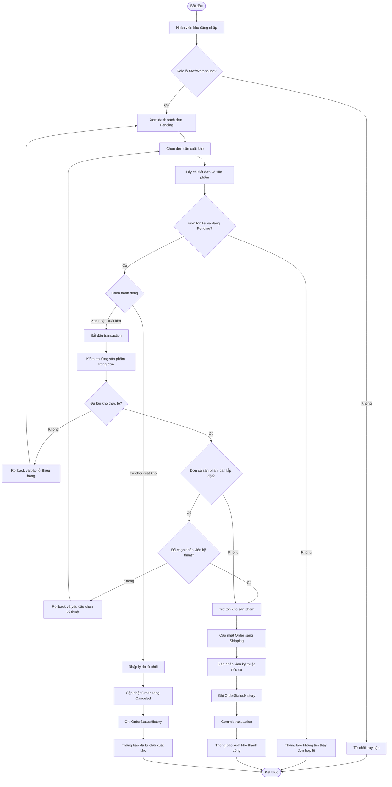
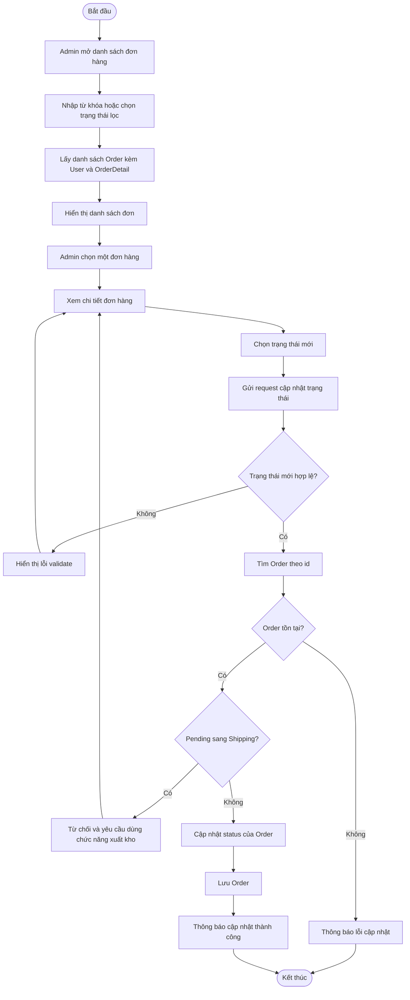
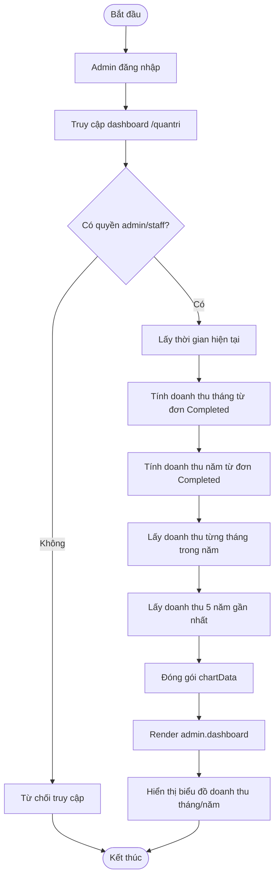
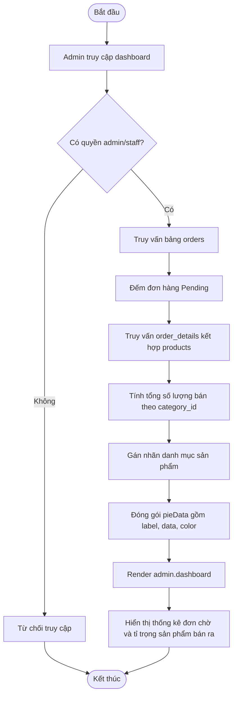

# Biểu đồ hoạt động cho project HomeTech

## 1. Đăng ký khách hàng



## 2. Đăng nhập khách hàng



## 3. Xem chi tiết sản phẩm

```mermaid
flowchart TD
    A([Bắt đầu]) --> B[Khách hàng chọn sản phẩm]
    B --> C[Gửi request /san-pham/{id}]
    C --> D[HomeController tìm Product theo id]
    D --> E{Sản phẩm tồn tại?}
    E -- Không --> F[Redirect về trang chủ]
    F --> G[Thông báo sản phẩm không tồn tại]
    G --> H([Kết thúc])
    E -- Có --> I[Lấy thông tin sản phẩm]
    I --> J[Render view client.detail]
    J --> K[Hiển thị chi tiết sản phẩm]
    K --> H
```

## 4. Tìm kiếm sản phẩm



## 5. Quản lý giỏ hàng

```mermaid
flowchart TD
    A([Bắt đầu]) --> B[Khách hàng thao tác với giỏ hàng]
    B --> C{Chọn hành động}
    C -- Thêm sản phẩm --> D[Gửi POST /gio-hang/them/{id}]
    D --> E[Tìm Product theo id]
    E --> F{Sản phẩm tồn tại?}
    F -- Không --> G[Thông báo sản phẩm không tồn tại]
    F -- Có --> H[Lấy giỏ hàng từ session]
    H --> I{Sản phẩm đã có trong giỏ?}
    I -- Có --> J[Cộng dồn số lượng]
    I -- Không --> K[Thêm item mới vào giỏ]
    J --> L[Lưu giỏ hàng vào session]
    K --> L
    L --> M[Redirect đến trang giỏ hàng]

    C -- Xem giỏ hàng --> N[Lấy cart từ session]
    N --> O[Tính tổng tiền]
    O --> P[Render view client.cart]

    C -- Xóa sản phẩm --> Q[Gửi request xóa item]
    Q --> R[Lấy cart từ session]
    R --> S{Item tồn tại?}
    S -- Có --> T[Xóa item và lưu session]
    S -- Không --> U[Không thay đổi giỏ hàng]
    T --> V[Quay lại trang giỏ hàng]
    U --> V

    G --> W([Kết thúc])
    M --> W
    P --> W
    V --> W
```

## 6. Tạo đơn hàng bán tại quầy POS



## 7. Quản lý sản phẩm của admin



## 8. Nhập kho



## 9. Xuất kho cho đơn hàng



## 10. Quản lý trạng thái đơn hàng



## 11. Xem báo cáo doanh thu



## 12. Thống kê đơn hàng


