# Mã Mermaid các biểu đồ tuần tự

## 1. Nhân viên/Admin đăng nhập và điều hướng theo vai trò

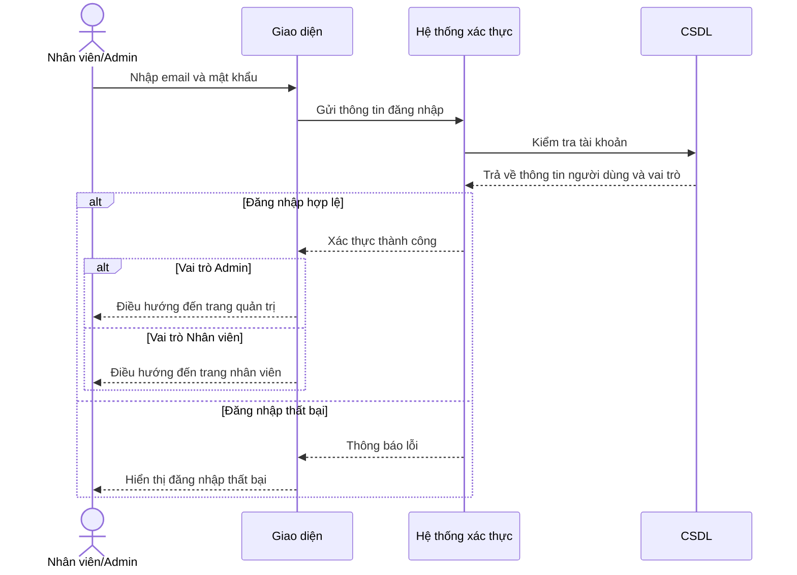

## 2. Khách hàng đăng ký tài khoản

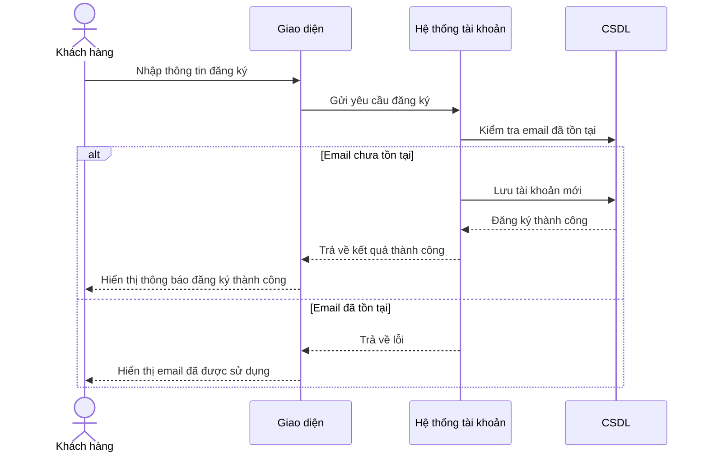

## 3. Khách hàng đăng nhập

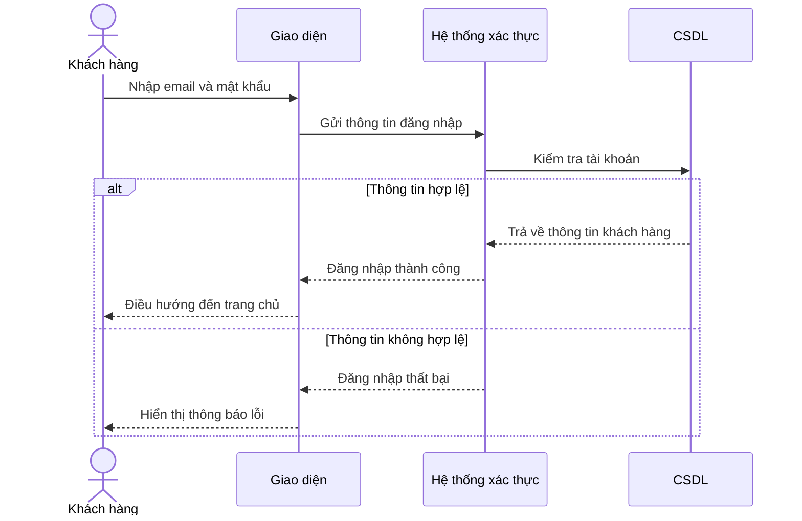

## 4. Khách hàng tìm kiếm sản phẩm

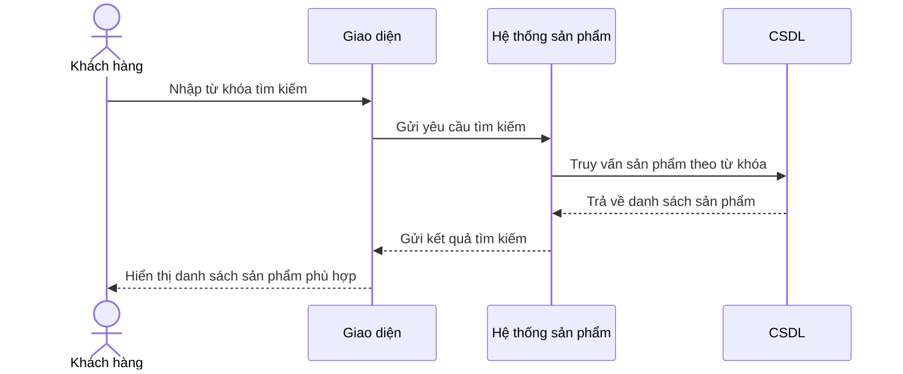

## 5. Khách hàng xem chi tiết sản phẩm

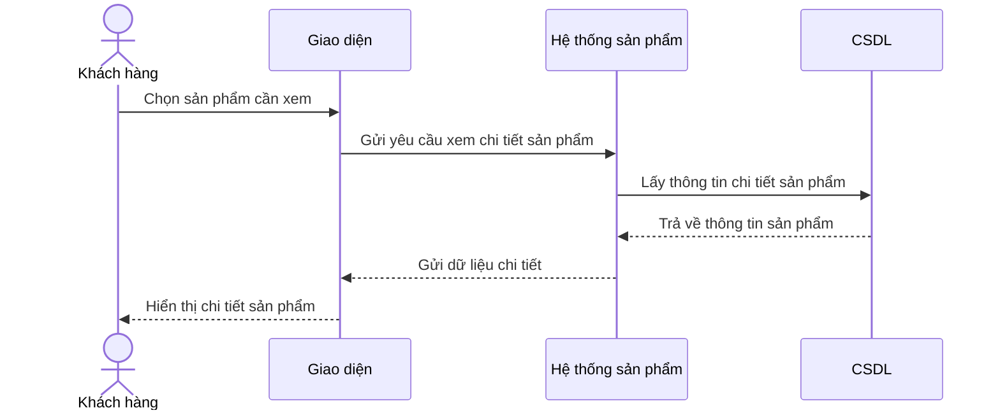

## 6. Khách hàng thêm sản phẩm vào giỏ hàng

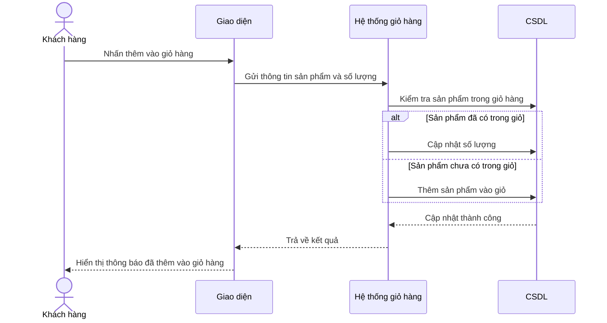

## 7. Khách hàng xem giỏ hàng

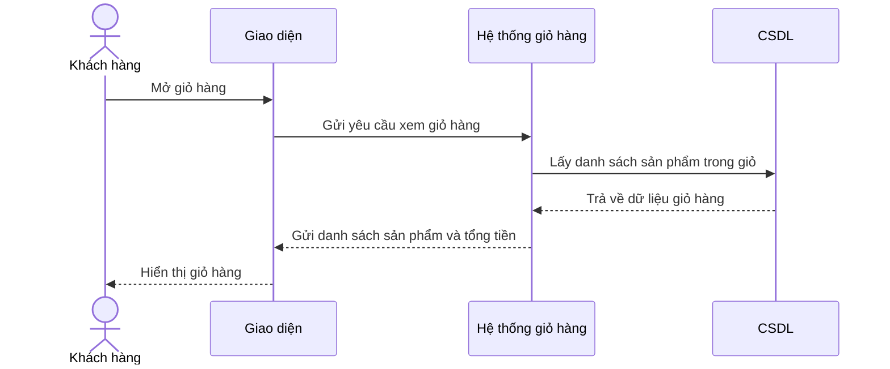

## 8. Khách hàng xóa sản phẩm khỏi giỏ hàng

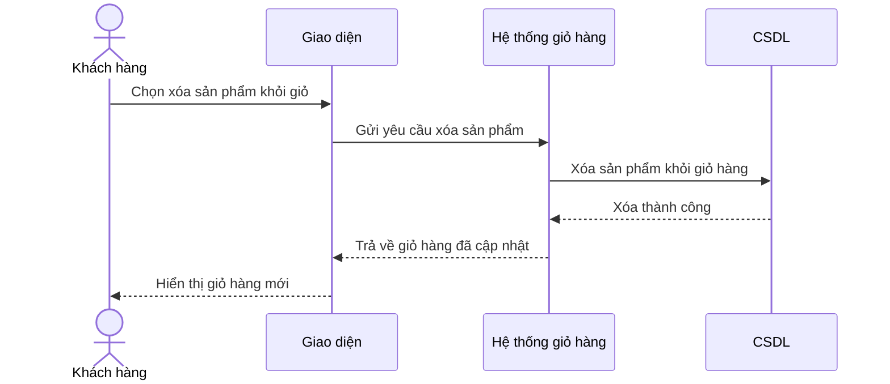

## 9. Admin quản lý sản phẩm: thêm sản phẩm

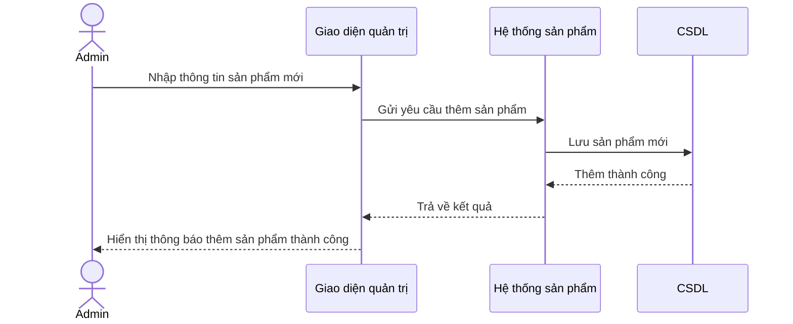

## 10. Admin quản lý sản phẩm: sửa sản phẩm

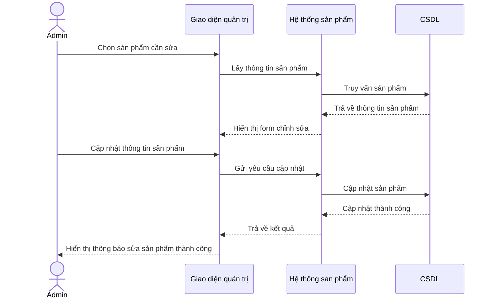

## 11. Admin quản lý sản phẩm: xóa sản phẩm

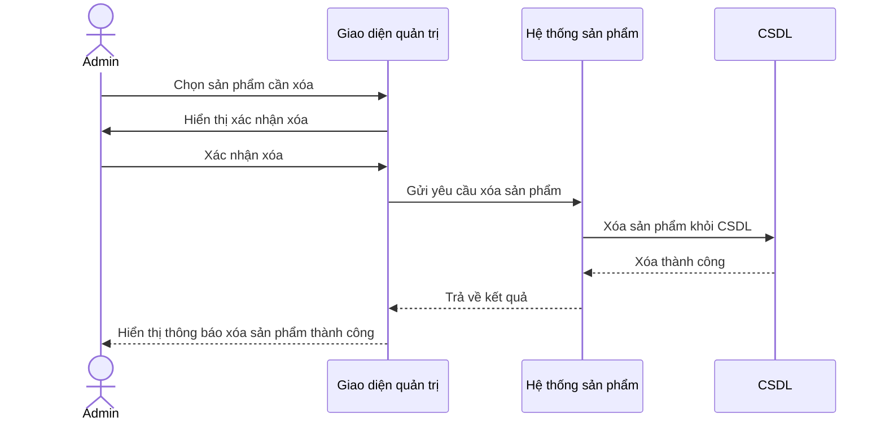

## 12. Nhân viên bán hàng tạo đơn hàng

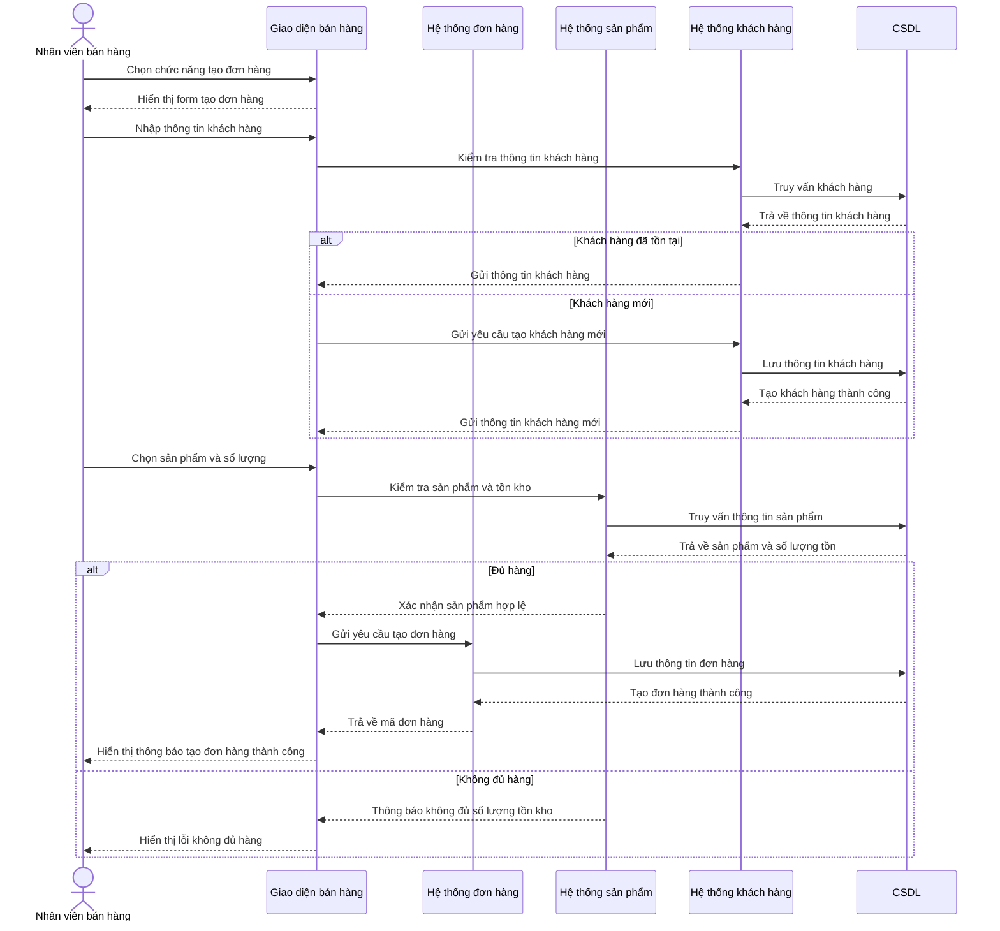

## 13. Quản lý kho hàng / Xác nhận xuất kho

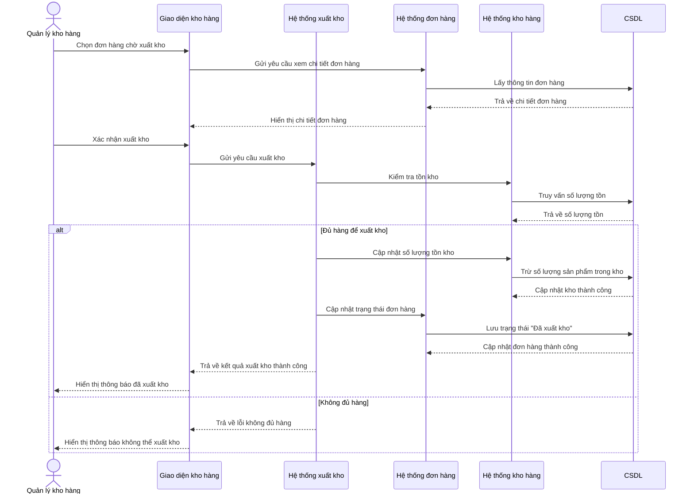

## 14. Nhân viên kỹ thuật cập nhật trạng thái lắp đặt

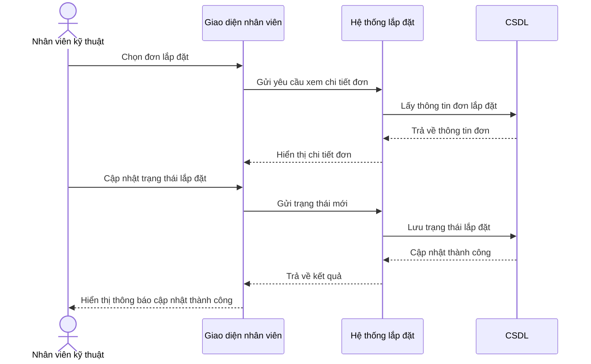

## 15. Thống kê đơn hàng

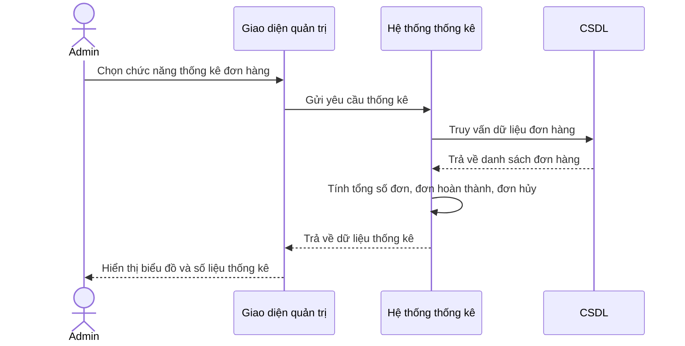

## 16. Xem báo cáo doanh thu

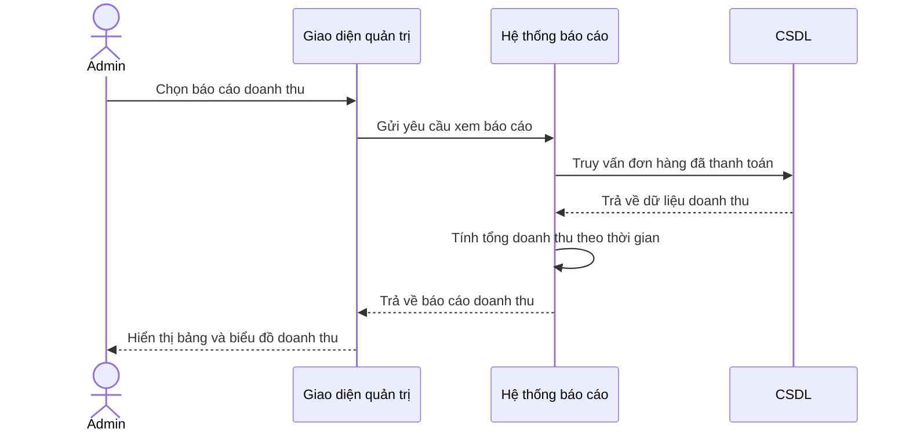
