# Bieu Do Tuan Tu

## 1. Nhan vien/Admin dang nhap va dieu huong theo vai tro

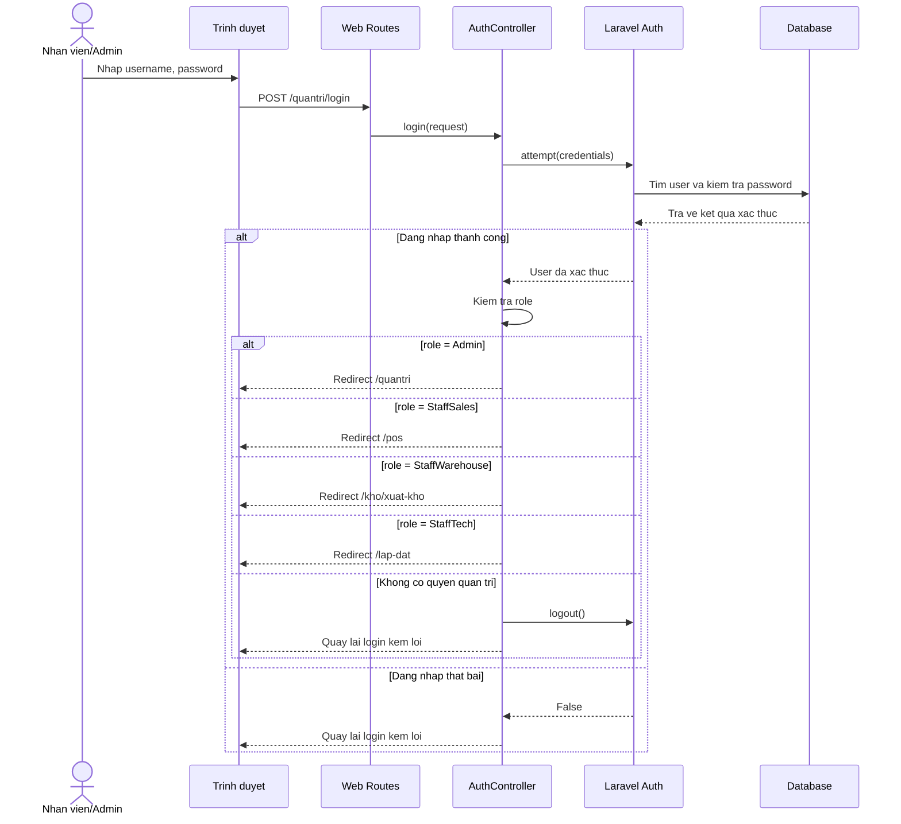

## 2. Khach hang dang ky tai khoan

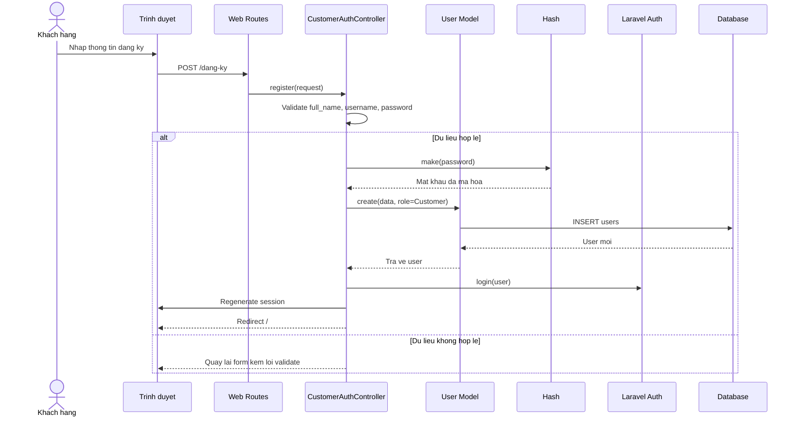

## 3. Khach hang dang nhap

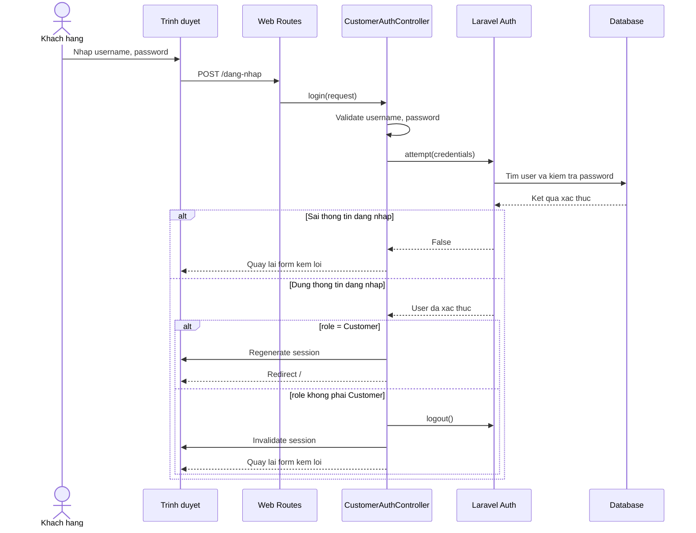

## 4. Khach hang tim kiem san pham

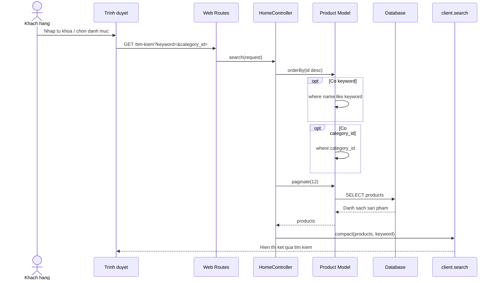

## 5. Khach hang xem chi tiet san pham

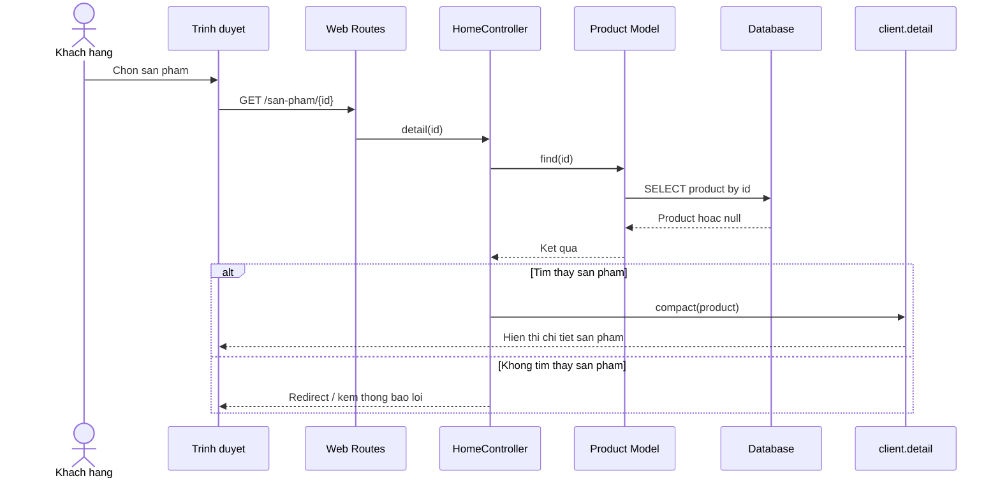

## 6. Khach hang them san pham vao gio hang

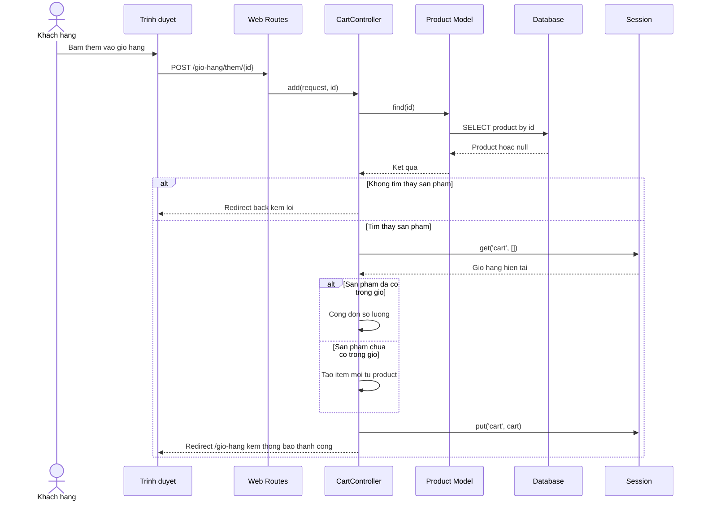

## 7. Khach hang xem gio hang

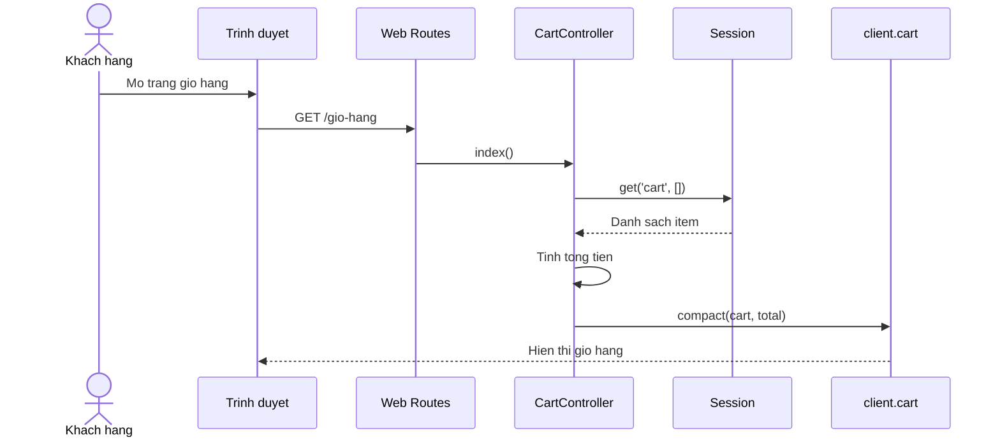

## 8. Khach hang xoa san pham khoi gio hang

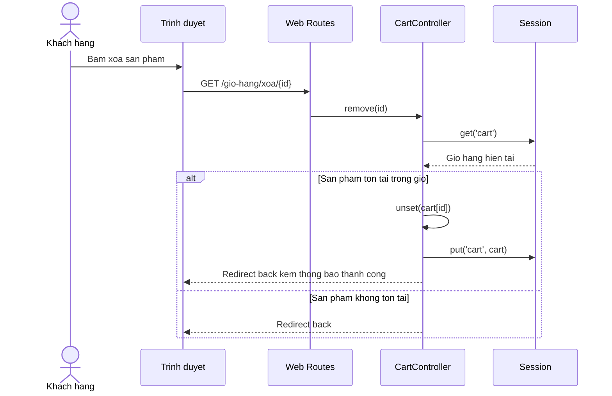

## 9. Admin quan ly san pham: them san pham

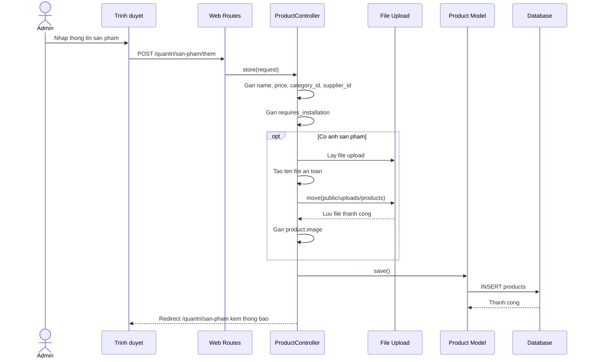

## 10. Admin quan ly san pham: sua san pham

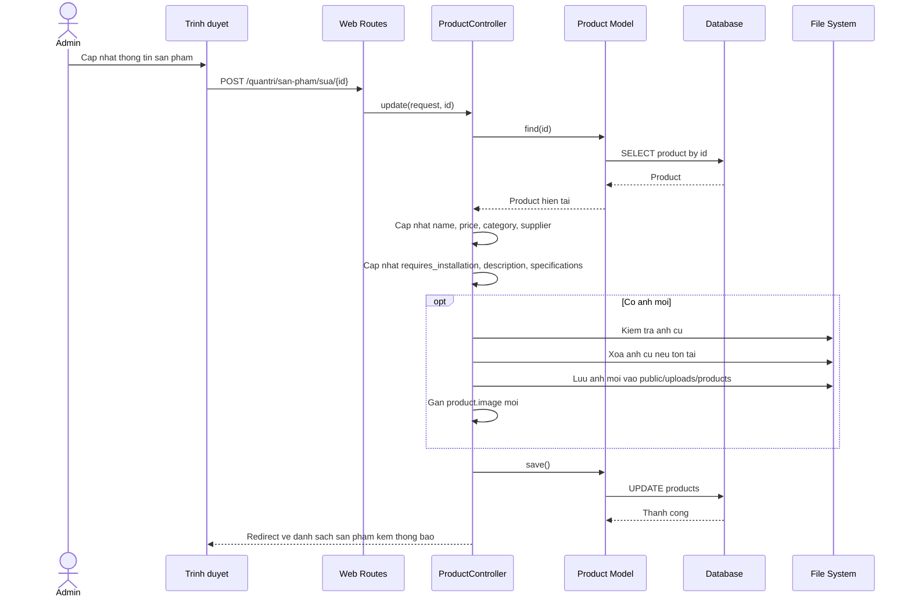

## 11. Nhan vien POS tao don ban hang

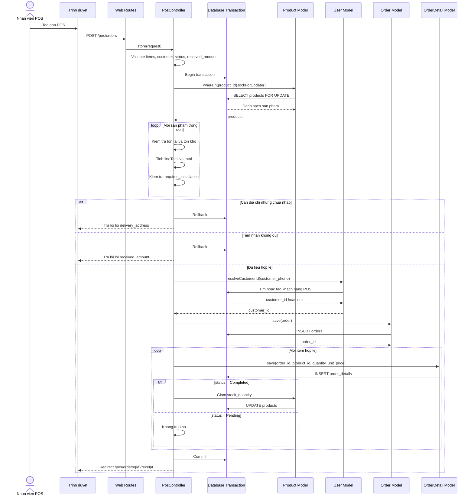

## 12. Nhan vien kho xac nhan / tu choi xuat kho

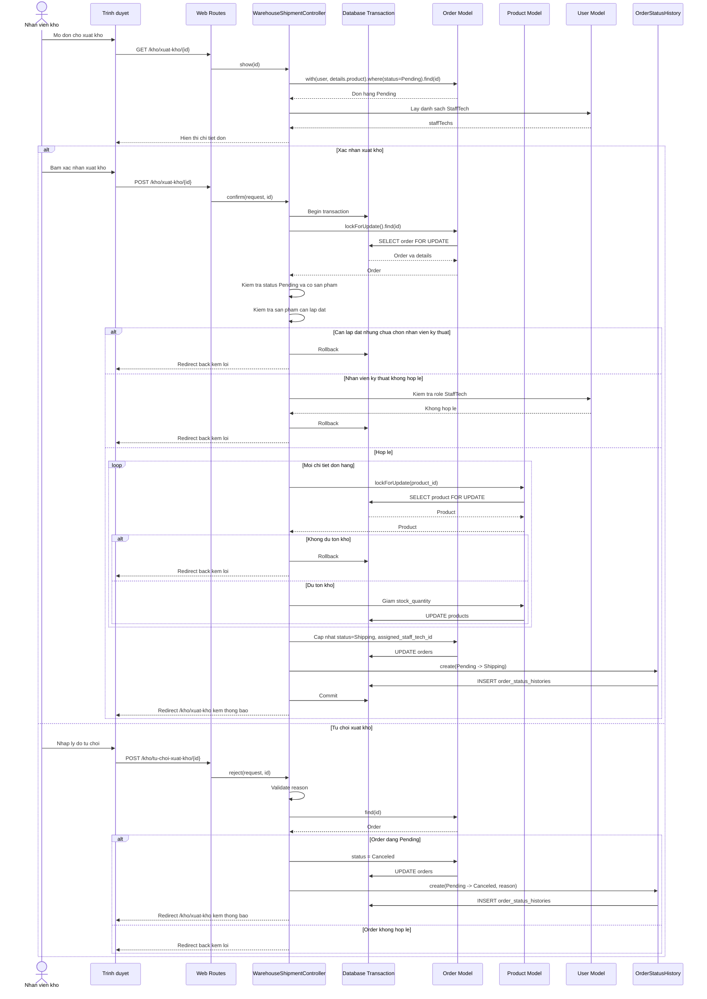

## 13. Nhan vien ky thuat cap nhat trang thai lap dat

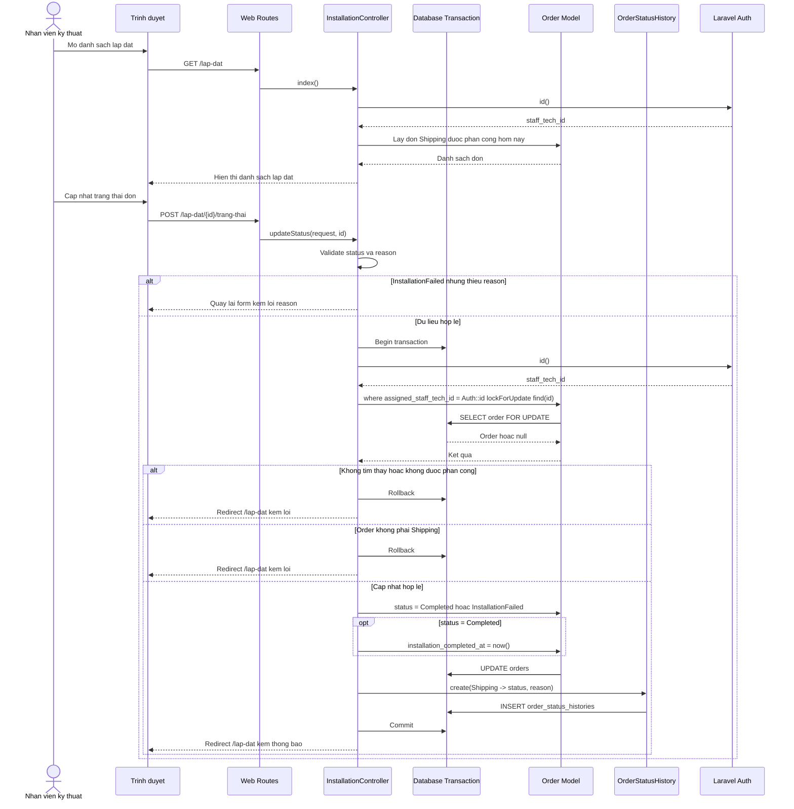

## 14. Thong ke don hang

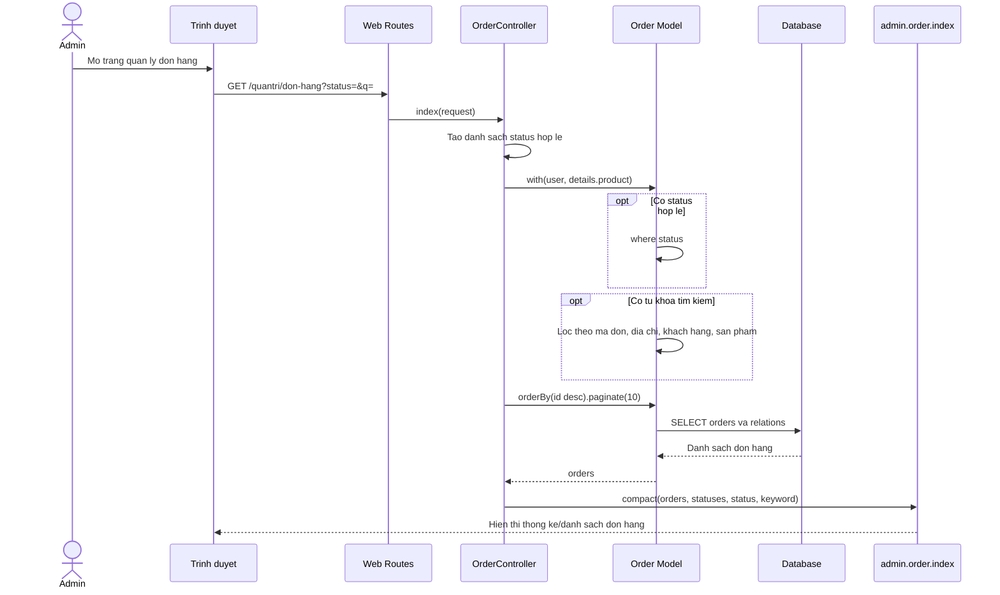

## 15. Xem bao cao doanh thu

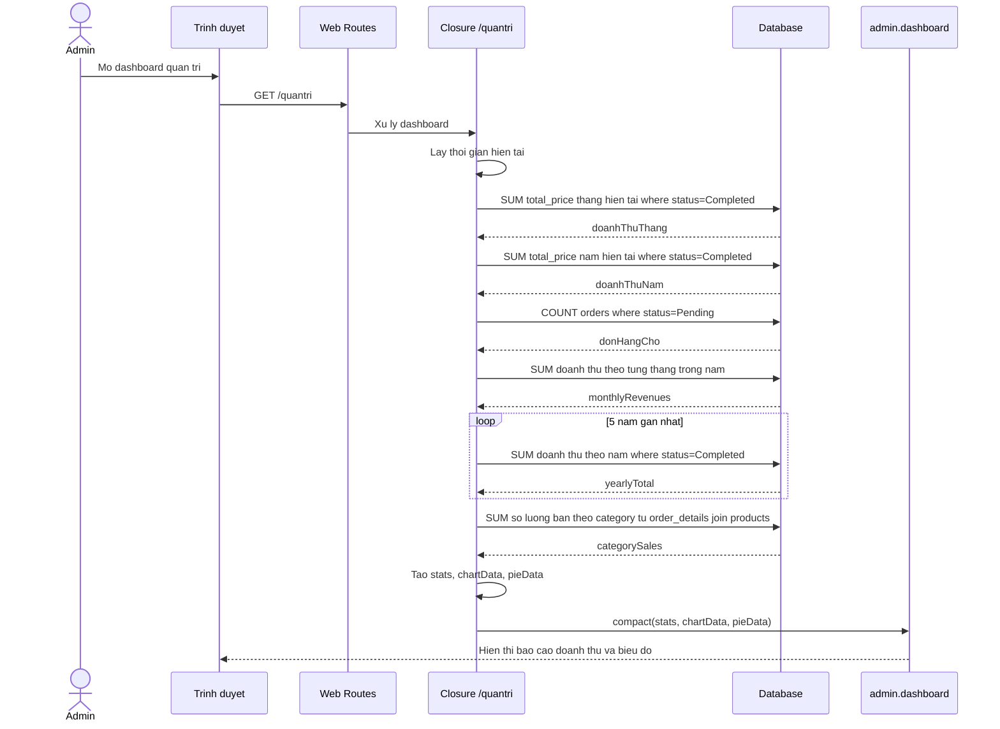
